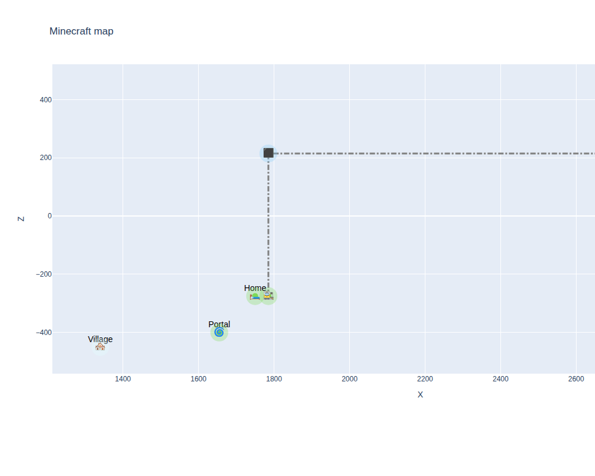

# Карта сервера Minecraft 🗺️

Интерактивная визуализация важных мест на нашем сервере Minecraft.

## Как запустить

1. Установи зависимости:

pip install -r requirements.txt

2. Запусти скрипт:

python map_plot.py

3. Откроется интерактивная карта в браузере ✨

## Файлы
- `data/places.json` — точки: дома, шахты, порталы
- `data/stations.json` — точки для железной дороги
- `data/colors.json` — цвета для биомов

## Хочешь добавить точку?
1. Добавь её в `places.json`
2. Сделай pull request ✅

